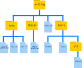

# Episode 7 Finding Things

## 7.1 Using `grep`

Which command would result in the following output:

~~~
and the presence of absence:
~~~

1. `grep "of" haiku.txt`
2. `grep -E "of" haiku.txt`
3. `grep -w "of" haiku.txt`
4. `grep -i "of" haiku.txt`

Solution

The correct answer is 3, because the `-w` option looks only for whole-word matches. The other options will also match ‘of’ when part of another word.

## 7.2 Tracking a Species

Leah has several hundred data files saved in one directory, each of which is formatted like this:

~~~
2013-11-05,deer,5
2013-11-05,rabbit,22
2013-11-05,raccoon,7
2013-11-06,rabbit,19
2013-11-06,deer,2
~~~

She wants to write a shell script that takes a species as the first command-line argument and a directory as the second argument. The script should return one file called `species.txt` containing a list of dates and the number of that species seen on each date. For example using the data shown above, `rabbit.txt` would contain:

~~~
2013-11-05,22
2013-11-06,19
~~~

Put these commands and pipes in the right order to achieve this:

~~~
cut -d : -f 2
>
|
grep -w $1 -r $2
|
$1.txt
cut -d , -f 1,3
~~~

Hint: use `man grep` to look for how to grep text recursively in a directory and `man cut` to select more than one field in a line.

An example of such a file is provided in `data-shell/data/animal-counts/animals.txt`

Solution

~~~
grep -w $1 -r $2 | cut -d : -f 2 | cut -d , -f 1,3  > $1.txt
~~~
You would call the script above like this:
~~~
$ bash count-species.sh bear .
~~~

## 7.2 Little Women

You and your friend, having just finished reading Little Women by Louisa May Alcott, are in an argument. Of the four sisters in the book, Jo, Meg, Beth, and Amy, your friend thinks that Jo was the most mentioned. You, however, are certain it was Amy. Luckily, you have a file `LittleWomen.txt` containing the full text of the novel (`data-shell/writing/data/LittleWomen.txt`). Using a `for` loop, how would you tabulate the number of times each of the four sisters is mentioned?

Hint: one solution might employ the commands `grep` and `wc` and a `|`, while another might utilize `grep` options. There is often more than one way to solve a programming task, so a particular solution is usually chosen based on a combination of yielding the correct result, elegance, readability, and speed.

Solution

~~~
for sis in Jo Meg Beth Amy
do
	echo $sis:
	grep -ow $sis LittleWomen.txt | wc -l
done
~~~

Alternative, slightly inferior solution:
~~~
for sis in Jo Meg Beth Amy
do
	echo $sis:
	grep -ocw $sis LittleWomen.txt
done
~~~
This solution is inferior because `grep -c` only reports the number of lines matched. The total number of matches reported by this method will be lower if there is more than one match per line.

Perceptive observers may have noticed that character names sometimes appear in all-uppercase in chapter titles (e.g. ‘MEG GOES TO VANITY FAIR’). If you wanted to count these as well, you could add the `-i` option for case-insensitivity (though in this case, it doesn’t affect the answer to which sister is mentioned most frequently).

## 7.3 Matching and Subtracting

The `-v` option to `grep` inverts pattern matching, so that only lines which do not match the pattern are printed. Given that, which of the following commands will find all files in `/data` whose names end in `s.txt` but whose names also do not contain the string `net`? (For example, `animals.txt` or `amino-acids.txt` but not `planets.txt`.) Once you have thought about your answer, you can test the commands in the `data-shell` directory.

1. `find data -name "*s.txt" | grep -v net`
2. `find data -name *s.txt | grep -v net`
3. `grep -v "net" $(find data -name "*s.txt")`
4. None of the above.

Solution

The correct answer is 1. Putting the match expression in quotes prevents the shell expanding it, so it gets passed to the `find` command.

Option 2 is incorrect because the shell expands `*s.txt` instead of passing the wildcard expression to `find`.

Option 3 is incorrect because it searches the contents of the files for lines which do not match ‘net’, rather than searching the file names.

## 7.3 `find` Pipeline Reading Comprehension

Write a short explanatory comment for the following shell script:
~~~
wc -l $(find . -name "*.dat") | sort -n
~~~

Solution

1. Find all files with a .dat extension recursively from the current directory
2. Count the number of lines each of these files contains
3. Sort the output from step 2. numerically

