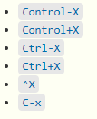

# Episode 2 Navigating Files and Directories


## 2.1 Exploring More `ls` Flags

What does the command `ls` do when used
with the `-l` option? 

What about if you use both the `-l` and the `-h` option?

<details>
<summary>Solution
</summary>
`-l` - long listing format, showing not only the file/directory names but also additional information such as the file size and the time of its last modification. Some of its output is about properties that we do not cover in this lesson (such as file permissions and ownership), but the rest should be useful nevertheless.   
 
`-h` + `-l`  - makes file size ‘Human readable’, i.e. `5.3K` instead of `5369`.
</details>

## 2.2 Listing in Reverse Chronological Order
By default ls lists the contents of a directory in alphabetical order by name. The command `ls -t` lists items by time of last change instead of alphabetically. The command `ls -r` lists the contents of a directory in reverse order. Which file is displayed last when you combine the `-t` and `-r` flags? Hint: You may need to use the `-l` flag to see the last changed dates.

<details>
<summary>Solution

</summary>
`-rt` - most recently changed file. 
          This can be very useful for finding your most recent edits or checking to see if a new output file was written.
</details>

## 2.3 Absolute vs Relative Paths
Starting from `/Users/amanda/data`, which of the following commands could Amanda use to navigate to her home directory, which is `/Users/amanda`?

1. `cd .`
2. `cd /`
3. `cd /home/amanda`
4. `cd ../..`
5. `cd ~`
6. `cd home`
7. `cd ~/data/..`
8. `cd`
9. `cd ..`


<details>
<summary>Solution
</summary>
1. No: `.` stands for the current directory.

2. No: `/` stands for the root directory.

3. No: Amanda's home directory is `/Users/amanda`.

4. No: this goes up two levels, i.e. ends in `/Users`.

5. Yes: `~` stands for the user's home directory, in this case `/Users/amanda`.

6. No: this would navigate into a directory `home` in the current directory if it exists.

<strong>7. Yes: unnecessarily complicated, but correct.</strong>

8. Yes: shortcut to go back to the user's home directory.

9. Yes: goes up one level.
</details>

## 2.4 Relative Path Resolution
If `pwd` displays `/Users/thing`,
 what will `ls -F ../backup` display?
1.  `../backup: No such file or directory`
2.  `2012-12-01 2013-01-08 2013-01-27`
3.  `2012-12-01/ 2013-01-08/ 2013-01-27/`
4.  `original/ pnas_final/ pnas_sub/`


<details>
<summary>Solution  
</summary>
1. No: there *is* a directory `backup` in `/Users`.  

2. No: this is the content of `Users/thing/backup`, but with `..` we asked for one level further up.  

3. No: see previous explanation.  

4. Yes: `../backup/` refers to `/Users/backup/`.
</details>

## 2.5 `ls` Reading Comprehension

If `pwd` displays `/Users/backup`,
and `-r` tells `ls` to display things in reverse order,
what command(s) will result in the following output:

~~~
pnas_sub/ pnas_final/ original/
~~~


1.  `ls pwd`
2.  `ls -r -F`
3.  `ls -r -F /Users/backup`
<details>
<summary>Solution
</summary>
1. No: `pwd` is not the name of a directory.

2. Yes: `ls` without directory argument lists files and directories in the current directory.

3. Yes: uses the absolute path explicitly.
</details>

# Episode 3 Working with Files and Directories



<!--- 
## 3.1 Creating Files a Different Way

We have seen how to create text files using the `nano` editor.
Now, try the following command:

 ~~~bash
 $ touch my_file.txt
 ~~~

1.  What did the `touch` command do?
When you look at your current directory using the GUI file explorer,
 does the file show up?

2.  Use `ls -l` to inspect the files.  How large is `my_file.txt`?

3.  When might you want to create a file this way?

<details>
<summary>Solution
</summary>
1.  The `touch` command generates a new file called `my_file.txt` in
    your current directory.  You
    can observe this newly generated file by typing `ls` at the
   command line prompt.  `my_file.txt` can also be viewed in your
   GUI file explorer.

 2.  When you inspect the file with `ls -l`, note that the size of
    `my_file.txt` is 0 bytes.  In other words, it contains no data.
   If you open `my_file.txt` using your text editor it is blank.

3.  Some programs do not generate output files themselves, but
    instead require that empty files have already been generated.
    When the program is run, it searches for an existing file to
   populate with its output.  The touch command allows you to
    efficiently generate a blank text file to be used by such
    programs.
</details>
--->
## 3.2 Moving Files to a new folder

Jamie realizes that she put the files `sucrose.dat` and `maltose.dat` into the wrong folder. 
The files should have been placed in the `raw` folder. She runs these commands to explore the file system.

~~~
$ ls -F
analyzed/ raw/

$ ls -F analyzed
fructose.dat glucose.dat maltose.dat sucrose.dat

$ cd analyzed
 ~~~


Fill in the blanks to move these files to the `raw/` folder to correct her mistake

 ~~~
$ mv sucrose.dat maltose.dat ____/____
~~~

<details>
<summary>Solution
</summary>

$ mv sucrose.dat maltose.dat ../raw

</details>

## 3.3 Renaming Files
 Suppose you created a text file called `statstics.txt`

 After creating and saving this file you realize you misspelled the filename! You want to
 correct the mistake, which of the following commands could you use to do so?

 1. `cp statstics.txt statistics.txt`
 2. `mv statstics.txt statistics.txt`
 3. `mv statstics.txt .`
 4. `cp statstics.txt .`

<details>
<summary>Solution
</summary>
 1. No.  While this would create a file with the correct name, the incorrectly named file still exists in the directory
 and would need to be deleted.
 
 2. Yes
 
 3. No, the period(.) indicates where to move the file, but does not provide a new file name; identical file names
 cannot be created.
 
 4. No, the period(.) indicates where to copy the file, but does not provide a new file name; identical file names
 cannot be created.
</details>

## 3.4 Moving and Copying

What is the output of the closing `ls` command in the sequence shown below?

 ~~~
 $ pwd
 ~~~

 ~~~
 /Users/jamie/data
 ~~~

 ~~~
 $ ls
 ~~~

 ~~~
 proteins.dat
 ~~~

 ~~~
 $ mkdir recombined
 $ mv proteins.dat recombined/
 $ cp recombined/proteins.dat ../proteins-saved.dat
 $ ls
~~~


 1.   `proteins-saved.dat recombined`
 2.   `recombined`
 3.   `proteins.dat recombined`
 4.   `proteins-saved.dat`

<details>
<summary>Solution
</summary>
 2. Yes
 
Starting in the `/Users/jamie/data` directory
  $ mkdir recombined ---- create new folder
  $ mv proteins.dat recombined/ ----- move proteins.dat to the new folder
  $ cp recombined/proteins.dat ../proteins-saved.dat ----- copies this file to the parent directory of our current location
</details>

<!--- 
## 3.5 Using `rm` Safely

 What happens when we execute `rm -i thesis_backup/quotations.txt`?
 Why would we want this protection when using `rm`?

<details>
<summary>Solution
</summary>
Prompt before (every) removal. The Unix shell doesn't have a trash bin, so all the files removed will disappear forever.
</details>


## 3.6 Copy with Multiple Filenames

 For this exercise, you can test the commands in the `data-shell/data` directory.

 In the example below, what does `cp` do when given several filenames and a directory name?

 ~~~
 $ mkdir backup
 $ cp amino-acids.txt animals.txt backup/
 ~~~


 In the example below, what does `cp` do when given three or more file names?

 ~~~
 $ ls -F
 ~~~

 ~~~
 amino-acids.txt  animals.txt  backup/  elements/  morse.txt  pdb/  planets.txt  salmon.txt  sunspot.txt
 ~~~

 ~~~
 $ cp amino-acids.txt animals.txt morse.txt
 ~~~


<details>
<summary>Solution
</summary>
 If given more than one file name followed by a directory name (i.e. the destination directory must
 be the last argument), `cp` copies the files to the named directory.

 If given three file names, `cp` throws an error, because it is expecting a directory
 name as the last argument.
</details>
--->
## Wildcards
(Examples from `data-shell/molecules` directory)
`*` matches zero or more characters. 
 
`*.pdb` matches `ethane.pdb`, `propane.pdb`, and every file that ends with `.pdb`. 
 
`p*.pdb` only matches `pentane.pdb` and `propane.pdb`

`?` matches exactly one character. 

`?ethane.pdb` would match `methane.pdb`
`*ethane.pdb` matches both `ethane.pdb`, and `methane.pdb`.
`???ane.pdb` matches three characters followed by `ane.pdb`, giving `cubane.pdb` `ethane.pdb` `octane.pdb`.


## 3.7 List filenames matching a pattern
List the contents of the `molecules` directory
Which `ls` command(s) will
 produce this output?

 `ethane.pdb   methane.pdb`

 1. `ls *t*ane.pdb`
 2. `ls *t?ne.*`
 3. `ls *t??ne.pdb`
 4. `ls ethane.*`

<details>
<summary>Solution
</summary>
  3.
</details>


## 3.8 Organizing Directories and Files
 Jamie is working on a project and she sees that her files aren't very well
 organized:

 ~~~
$ ls -F
 ~~~

~~~
 analyzed/  fructose.dat    raw/   sucrose.dat
 ~~~


 The `fructose.dat` and `sucrose.dat` files contain output from her data
 analysis. How could you use wildcards with the `mv` command to move both files to the `analyzed` directory at the same time?

<details>
<summary>Solution
</summary>
 mv *.dat analyzed
 </details>
 
<!---
## 3.9 Reproduce a folder structure

 You're starting a new experiment, and would like to duplicate the directory
 structure from your previous experiment so you can add new data.

 Assume that the previous experiment is in a folder called '2016-05-18',
 which contains a `data` folder that in turn contains folders named `raw` and
 `processed` that contain data files.  The goal is to copy the folder structure
 of the `2016-05-18-data` folder into a folder called `2016-05-20`
 so that your final directory structure looks like this:

	2016-05-20/
	└── data
	    ├── processed
	    └── raw

 Which of the following set of commands would achieve this objective?
 What would the other commands do?

 ~~~
 $ mkdir 2016-05-20
 $ mkdir 2016-05-20/data
 $ mkdir 2016-05-20/data/processed
 $ mkdir 2016-05-20/data/raw
 ~~~

 ~~~
 $ mkdir 2016-05-20
 $ cd 2016-05-20
 $ mkdir data
 $ cd data
 $ mkdir raw processed
 ~~~

 ~~~
 $ mkdir 2016-05-20/data/raw
 $ mkdir 2016-05-20/data/processed
 ~~~

 ~~~
 $ mkdir -p 2016-05-20/data/raw
 $ mkdir -p 2016-05-20/data/processed
 ~~~

 ~~~
 $ mkdir 2016-05-20
 $ cd 2016-05-20
 $ mkdir data
 $ mkdir raw processed
 ~~~


<details>
<summary>Solution
</summary>
 The first two sets of commands achieve this objective.
 The first set uses relative paths to create the top level directory before
 the subdirectories.

 The third set of commands will give an error because the default behavior of `mkdir` won't create a subdirectory
 of a non-existant directory: the intermediate level folders must be created first.

 The fourth set of commands achieve this objective. Remember, the `-p` option, followed by a path of one or more 
 directories, will cause `mkdir` to create any intermediate subdirectories as required.

 The final set of commands generates the 'raw' and 'processed' directories at the same level
 as the 'data' directory.
</details>
--->

# Episode 4 Pipes and Filters

## Exercise 4.1 Sorting
If we run sort on a file containing the following lines:
`10`   
`2`   
`19`   
`22`   
`6`   
the output is:   
`10`   
`19`  
`2`  
`22`   
`6`   

If we run sort -n on the same input, we get this instead:   
`2`   
`6`   
`10`   
`19`   
`22` 
  
Why?

## Exercise 4.2
We have already met the head command, which prints lines from the start of a file. tail is similar, but prints lines from the end of a file instead.

If we were to run these 2 commands:
```.env
$ head -n 3 animals.txt > animals-subset.txt
$ tail -n 2 animals.txt >> animals-subset.txt
```
what would animals.txt contain?
1. The first three lines of animals.txt  
2. The last two lines of animals.txt  
3. The first three lines and the last two lines of animals.txt   
4. The second and third lines of animals.txt   

<details>
<summary>Solution
</summary>
3.
</details>


## Exercise 4.3
In our current directory, we want to find the 3 files which have the least number of lines. Which command would work?

1. `wc -l * > sort -n > head -n 3   `
2. `wc -l * | sort -n | head -n 1-3 `  
3. `wc -l * | head -n 3 | sort -n ` 
4. `wc -l * | sort -n | head -n 3 `  

<details>
<summary>Solution
</summary>
4.        
The pipe character | is used to connect the output from one command to the input of another. > is used to redirect standard output to a file
</details>


## Exercise 4.4
A file called animals.txt looks like this:
```
2012-11-05,deer
2012-11-05,rabbit
2012-11-05,raccoon
2012-11-06,rabbit
2012-11-06,deer
2012-11-06,fox
2012-11-07,rabbit
2012-11-07,bear
```
If we run this command, what lines will end up in `final.txt`?
```
$ cat animals.txt | head -n 5 | tail -n 3 | sort -r > final.txt
```
<details>
<summary>Solution
</summary>
2012-11-06,rabbit
2012-11-06,deer
2012-11-05,raccoon
</details>

